<div align="center">



<br />


<p>
  <a href="https://victor-space-portfolio.vercel.app"></a>
  <a href="https://www.linkedin.com/in/victorvengatesh"></a>
  <a href="mailto:mvictorvengatesh@gmail.com"></a>
  <a href="https://leetcode.com/u/VICTORVENGATESH"></a>
</p>


</div>

---

## こんにちは — I'm Victor

```yaml
name: M. Victor Vengatesh
education: B.E. Artificial Intelligence & Machine Learning
college: V.S.B. Engineering College, Karur
based_in: Tamil Nadu, India
building: AI products that are practical, explainable and human-friendly
currently_learning: [Java, DSA, RAG, LLM systems, Full-Stack Development]
open_to: AI/ML opportunities, software roles and open-source collaboration
```

I enjoy connecting **AI engineering, software development and visual design**. My goal is simple: understand a real problem, build a reliable solution, and present it as an experience people enjoy using.

---

## Featured Work

<table>
<tr>
<td width="50%" valign="top">

### 🏥 [MotherCare AI](https://github.com/victorvengatesh/MotherCare-AI)

An AI-assisted maternal-health platform designed to make care information more accessible and supportive.

`AI` `Healthcare` `Full Stack` `Voice Experience`

</td>
<td width="50%" valign="top">

### 📄 [AI Resume Analyzer](https://github.com/victorvengatesh/resume-analyzer)

Analyses resumes against job requirements and produces structured, evidence-based match insights.

`React` `TypeScript` `NLP` `Semantic Evaluation`

</td>
</tr>
<tr>
<td width="50%" valign="top">

### ⛩️ [Interactive Portfolio](https://github.com/victorvengatesh/victor-space-portfolio)

A cinematic Japanese-temple portfolio with scroll-driven storytelling and polished motion.

`Next.js` `Motion` `TypeScript` `Visual Design`

**[Visit live experience →](https://victor-space-portfolio.vercel.app)**

</td>
<td width="50%" valign="top">

### ⚖️ ClauseAI

A multi-agent legal-contract analysis concept that turns dense clauses into structured risks and obligations.

`Python` `LangChain` `CrewAI` `RAG`

*Currently evolving.*

</td>
</tr>
</table>

---

## My Builder Toolkit

<div align="center">

### Languages


### AI, Web & Tools


<br /><br />


</div>

---

## Current Quest

- Mastering **Java, DSA and interview problem-solving**
- Building dependable **LLM, RAG and multi-agent workflows**
- Improving **React, Next.js and product-oriented full-stack development**
- Designing interfaces with stronger **motion, accessibility and visual storytelling**
- Contributing to meaningful, beginner-friendly **open-source projects**

---

## GitHub Pulse

<div align="center">


### Contribution Journey

<picture>
  <source media="(prefers-color-scheme: dark)" srcset="https://raw.githubusercontent.com/victorvengatesh/victorvengatesh/output/github-contribution-grid-snake-dark.svg" />
  <source media="(prefers-color-scheme: light)" srcset="https://raw.githubusercontent.com/victorvengatesh/victorvengatesh/output/github-contribution-grid-snake.svg" />
  
</picture>

</div>

---

<div align="center">

### Build with curiosity. Design with purpose. Improve every day.

<a href="https://victor-space-portfolio.vercel.app">
  
</a>

<br /><br />

<sub>Thanks for visiting. If one of my projects interests you, start a conversation.</sub>

</div>
